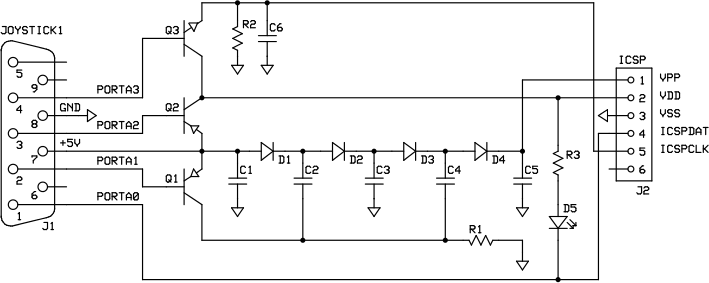

# Atari PIC programmer

This is a tool to program a PIC microcontroller from an Atari 8bit computer
using the JOY2PIC interface.

The tool consists of two main programs, both run on the Atari:

- **READHEX**: This program reads an existing `.hex` file with a PIC firmware
  and builds another atari executable capable of programming the
  microcontroller.

- **PICREAD**: This tools reads and displays the contents of a PIC memory.

- **SETVPP**: A tool to activate the VPP (programming voltage) signal in the
  JOY2PIC interface, this allows measuring the output voltage to assure that
  the programming will work.

## The JOY2PIC interface

To use this tool you need the JOY2PIC interface, developed in the AtariAge
forum, you can see here the basic schematic:

For further instructions, see the atariage forum posts:
http://atariage.com/forums/topic/247065-create-icsp-programmer-for-embedded-micro-controller-chips/?p=3572599

## Compiling

To compile the sources, you need the [CC65 compiler](http://cc65.github.io/cc65/),
the [MADS assembler](http://mads.atari8.info/) and my
[MKATR tool](https://github.com/dmsc/mkatr).

The provided Makefile works in any Unix like environment and assumes that the
tools are available in the path, so simply typing `make` will generate the
`picprog.atr` disk image.

# License

All the programs with source are under the GNU GPL license:

> Copyright (C) 2016 Daniel Serpell
>
> This program is free software; you can redistribute it and/or modify
> it under the terms of the GNU General Public License as published by
> the Free Software Foundation, either version 2 of the License, or
> (at your option) any later version.
>
> This program is distributed in the hope that it will be useful,
> but WITHOUT ANY WARRANTY; without even the implied warranty of
> MERCHANTABILITY or FITNESS FOR A PARTICULAR PURPOSE.  See the
> GNU General Public License for more details.
>
> You should have received a copy of the GNU General Public License along
> with this program.  If not, see <http://www.gnu.org/licenses/>

Also, in the `bin/dos` directory are two programs extracted from BW-DOS 1.3
disk, those are under the following license:

> BW-DOS may be freely used and distributed under following conditions:
> - Only the whole and unchanged master disk may be distributed,
> - It may not be sold, excepting little costs in PD services,
> - When used as a part of another software package, the whole package may be
>   marked with a "(C)", sold etc.; in this case it's possible to exclude files
>   from BW-DOS, but all distributed files still must be unchanged, and an
>   information where the whole BW-DOS is available must be included.

I assumed that the last clause means that I'm able to distribute the two
unchanged files.
